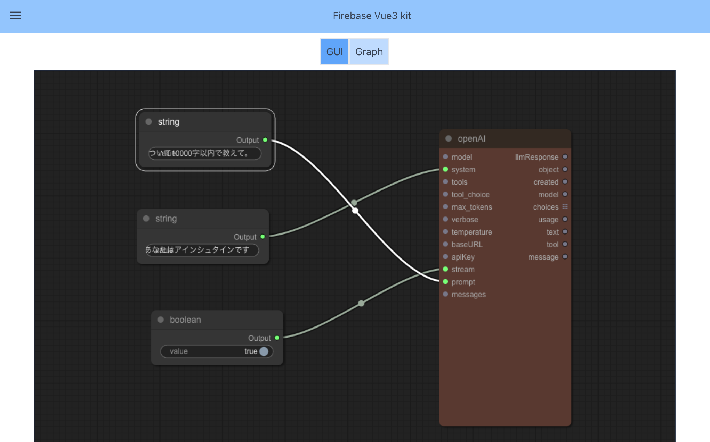

# GraphAI Graph Builder

## 📋 Requirements

- Node.js version 20 or later.



# Usage

## 📖 Instruction

```
yarn install
```

### run server

see https://github.com/receptron/graphai-agent-server

### run vue

```
yarn run serve
```
